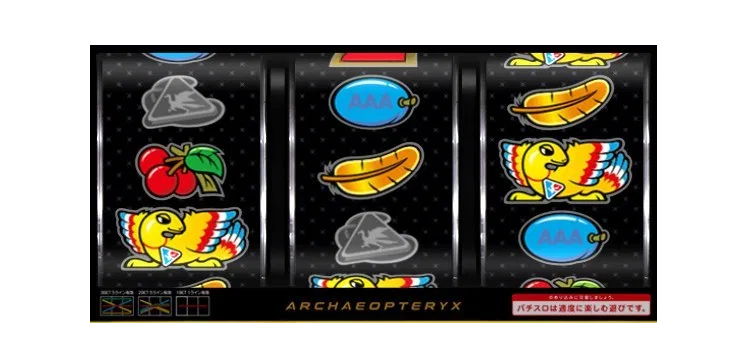

import Counter from '../../src/a-count/counter'
import Rcountera from '../../src/a-count/ratio-counter-a'

### 1.ボーナス確率・機械割

|S|Big|Reg|Sum|Rate|Grate|
|---|---|---|---|---|---|
|1|292.6|381.0|165.5|100.2|100.2|
|2|287.4|356.2|159.1|99.8|102.1|
|5|277.7|331.0|151.0|102.6|105.0|
|6|264.3|309.1|142.5|106.1|108.5|

- Big 335枚 Reg 116枚
- ベース 34.7-36.4G/50枚

### 2.打ち方

- 1枚役フォロー 右上段に赤７の上段羽テンパイ時
- 予告音で子役、リプレイ否定
- ぶどう 1/256
- Big中、チェリー付き鳥を左下段にビタ押し、中右も鳥を狙う
- Reg中、ぶどう付き鳥を左下段にビタ押し

### 3.子役カウント

#### 通常時の羽合算

|s1|s2|s5|s6|
|--|--|--|--|
|13.9|13.6|13.2|12.7|

<Counter count="arex-count" start="arex-start" />

#### Big 23G 斜め羽・羽・鳥

- 右上がり羽・羽・鳥

|s1|s2|s5|s6|
|--|--|--|--|
|26.7|32.0|22.9|26.7|

<Rcountera count1="arex-sample" count2="arex-trial" />

- 右下がり羽・羽・鳥で、設定1否定

|s1|s2|s5|s6|
|--|--|--|--|
|-|595.8|1191.6|595.8|

#### Big中ハズレ 

- 12 - 1/16384 5 - 1/595.8 6 - 1/1191.6

